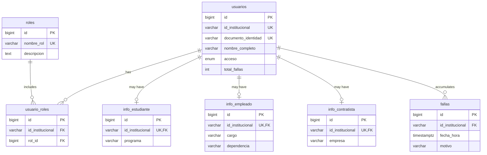

## Prerequisites

<CardGroup cols={2}>
  <Card title="Supabase Account" icon="user">
    Create a free account at [supabase.com](https://supabase.com)
  </Card>
  <Card title="SQL Files" icon="file-code">
    Access to the `/database/supabase/` directory in the source repository
  </Card>
</CardGroup>

---

## Installation Steps

<Steps>
  <Step title="Create a New Project">
    1. Go to the [Supabase Dashboard](https://app.supabase.com)
    2. Click **New Project**
    3. Fill in:
       - **Name**: `ucc-control-acceso`
       - **Database Password**: Generate a strong password (save it securely)
       - **Region**: Choose the closest to Colombia (e.g., `South America (São Paulo)`)
    4. Click **Create new project**
    
    <Info>
    Project creation takes 1-2 minutes. Wait for the "Project ready" status.
    </Info>
  </Step>

  <Step title="Open the SQL Editor">
    1. In the left sidebar, click **SQL Editor**
    2. Click **New Query** to open a blank editor
  </Step>

  <Step title="Run Schema Creation Scripts">
    Execute the SQL files **in order**. Copy the contents of each file and run them in the SQL Editor.

    <AccordionGroup>
      <Accordion title="01_usuarios.sql - Core User Table">
        ```sql
        -- Create the estado_de_acceso enum type
        DROP TYPE IF EXISTS estado_de_acceso CASCADE;
        CREATE TYPE estado_de_acceso AS ENUM ('activo', 'bloqueado');

        -- Create usuarios table
        CREATE TABLE usuarios (
            id                  BIGINT GENERATED ALWAYS AS IDENTITY PRIMARY KEY,
            id_institucional    VARCHAR(20)       NOT NULL UNIQUE,
            documento_identidad VARCHAR(20)       NOT NULL UNIQUE,
            nombre_completo     VARCHAR(150)      NOT NULL,
            acceso              estado_de_acceso  NOT NULL DEFAULT 'activo',
            total_fallas        INT               NOT NULL DEFAULT 0
        );

        -- Add comments
        COMMENT ON TABLE  usuarios IS 'Tabla principal de usuarios del sistema UCC';
        COMMENT ON COLUMN usuarios.id IS 'Identificador interno único';
        COMMENT ON COLUMN usuarios.id_institucional IS 'ID asignado por la UCC';
        COMMENT ON COLUMN usuarios.documento_identidad IS 'Cédula de ciudadanía';
        COMMENT ON COLUMN usuarios.nombre_completo IS 'Nombre completo del usuario';
        COMMENT ON COLUMN usuarios.acceso IS 'activo = puede ingresar | bloqueado = acceso denegado';
        COMMENT ON COLUMN usuarios.total_fallas IS 'Contador acumulado de olvidos (máx 4 antes de bloqueo)';

        -- Create indexes
        CREATE INDEX idx_usuarios_id_institucional ON usuarios (id_institucional);
        CREATE INDEX idx_usuarios_documento ON usuarios (documento_identidad);
        CREATE INDEX idx_usuarios_acceso ON usuarios (acceso);
        ```
      </Accordion>

      <Accordion title="02_roles.sql - Roles and Role Assignment">
        ```sql
        -- Create roles catalog
        DROP TABLE IF EXISTS usuario_roles CASCADE;
        DROP TABLE IF EXISTS roles CASCADE;

        CREATE TABLE roles (
            id         BIGINT GENERATED ALWAYS AS IDENTITY PRIMARY KEY,
            nombre_rol VARCHAR(50) NOT NULL UNIQUE,
            descripcion TEXT
        );

        -- Insert fixed roles
        INSERT INTO roles (nombre_rol, descripcion) VALUES
            ('Estudiante',   'Usuario matriculado en un programa académico'),
            ('Empleado',     'Trabajador vinculado directamente a la UCC'),
            ('Contratista',  'Proveedor externo con contrato activo');

        -- Create junction table
        CREATE TABLE usuario_roles (
            id               BIGINT GENERATED ALWAYS AS IDENTITY PRIMARY KEY,
            id_institucional VARCHAR(20) NOT NULL REFERENCES usuarios(id_institucional) ON DELETE CASCADE,
            rol_id           BIGINT      NOT NULL REFERENCES roles(id),
            CONSTRAINT uq_usuario_rol UNIQUE (id_institucional, rol_id)
        );

        -- Create indexes
        CREATE INDEX idx_usuario_roles_institucional ON usuario_roles (id_institucional);
        CREATE INDEX idx_usuario_roles_rol ON usuario_roles (rol_id);
        ```
      </Accordion>

      <Accordion title="03-05: Info Tables (Student, Employee, Contractor)">
        Run each of these three scripts to create the role-specific information tables:

        **03_info_estudiante.sql**
        ```sql
        DROP TABLE IF EXISTS info_estudiante CASCADE;

        CREATE TABLE info_estudiante (
            id               BIGINT GENERATED ALWAYS AS IDENTITY PRIMARY KEY,
            id_institucional VARCHAR(20)  NOT NULL UNIQUE
                             REFERENCES usuarios(id_institucional) ON DELETE CASCADE,
            programa         VARCHAR(150) NOT NULL
        );

        CREATE INDEX idx_info_est_id_inst ON info_estudiante (id_institucional);
        ```

        **04_info_empleado.sql**
        ```sql
        DROP TABLE IF EXISTS info_empleado CASCADE;

        CREATE TABLE info_empleado (
            id               BIGINT GENERATED ALWAYS AS IDENTITY PRIMARY KEY,
            id_institucional VARCHAR(20)  NOT NULL UNIQUE
                             REFERENCES usuarios(id_institucional) ON DELETE CASCADE,
            cargo            VARCHAR(150) NOT NULL,
            dependencia      VARCHAR(150) NOT NULL
        );

        CREATE INDEX idx_info_emp_id_inst ON info_empleado (id_institucional);
        ```

        **05_info_contratista.sql**
        ```sql
        DROP TABLE IF EXISTS info_contratista CASCADE;

        CREATE TABLE info_contratista (
            id               BIGINT GENERATED ALWAYS AS IDENTITY PRIMARY KEY,
            id_institucional VARCHAR(20)  NOT NULL UNIQUE
                             REFERENCES usuarios(id_institucional) ON DELETE CASCADE,
            empresa          VARCHAR(200) NOT NULL
        );

        CREATE INDEX idx_info_con_id_inst ON info_contratista (id_institucional);
        ```
      </Accordion>

      <Accordion title="06_triggers_roles.sql - Automatic Role Assignment">
        This script creates triggers that automatically assign/revoke roles when info tables are modified.

        <Tip>
        Copy the entire file contents from `06_triggers_roles.sql` (205 lines). This includes:
        - `fn_asignar_rol()` function
        - `fn_revocar_rol()` function
        - 6 triggers (2 per info table: INSERT and DELETE)
        </Tip>
      </Accordion>

      <Accordion title="07_fallas.sql - Failure Tracking and Auto-Blocking">
        ```sql
        DROP TABLE IF EXISTS fallas CASCADE;

        CREATE TABLE fallas (
            id               BIGINT GENERATED ALWAYS AS IDENTITY PRIMARY KEY,
            id_institucional VARCHAR(20)  NOT NULL
                             REFERENCES usuarios(id_institucional) ON DELETE CASCADE,
            fecha_hora       TIMESTAMPTZ  NOT NULL DEFAULT NOW(),
            motivo           VARCHAR(10)  NOT NULL
                             CHECK (motivo IN ('olvido', 'perdida'))
        );

        CREATE INDEX idx_fallas_id_inst ON fallas (id_institucional);
        CREATE INDEX idx_fallas_fecha_hora ON fallas (fecha_hora DESC);

        -- Trigger function: recalculate total_fallas and auto-block at 4
        CREATE OR REPLACE FUNCTION fn_actualizar_fallas()
        RETURNS TRIGGER
        LANGUAGE plpgsql
        AS $$
        DECLARE
            v_id_inst   VARCHAR(20);
            v_total     INT;
        BEGIN
            v_id_inst := CASE WHEN TG_OP = 'DELETE' THEN OLD.id_institucional
                                                     ELSE NEW.id_institucional END;

            SELECT COUNT(*) INTO v_total
            FROM fallas
            WHERE id_institucional = v_id_inst;

            UPDATE usuarios
            SET total_fallas = v_total,
                acceso       = CASE WHEN v_total >= 4 THEN 'bloqueado' ELSE acceso END
            WHERE id_institucional = v_id_inst;

            RETURN NULL;
        END;
        $$;

        -- Triggers
        CREATE TRIGGER trg_fallas_insert
            AFTER INSERT ON fallas
            FOR EACH ROW
            EXECUTE FUNCTION fn_actualizar_fallas();

        CREATE TRIGGER trg_fallas_delete
            AFTER DELETE ON fallas
            FOR EACH ROW
            EXECUTE FUNCTION fn_actualizar_fallas();
        ```
      </Accordion>

      <Accordion title="08_rls_policies.sql - Row Level Security">
        This script enables RLS on all tables and creates permissive policies.

        <Warning>
        The default policies allow public access for development. **Update these policies in production** to restrict access based on authentication.
        </Warning>

        <Tip>
        Copy the entire file contents from `08_rls_policies.sql` (185 lines).
        </Tip>
      </Accordion>

      <Accordion title="09_semestres.sql - Semester Management">
        ```sql
        CREATE TABLE IF NOT EXISTS semestres (
          id           BIGSERIAL PRIMARY KEY,
          nombre       TEXT        NOT NULL,
          fecha_inicio DATE        NOT NULL,
          fecha_fin    DATE        NOT NULL,
          activo       BOOLEAN     NOT NULL DEFAULT true,
          creado_en    TIMESTAMPTZ NOT NULL DEFAULT now(),
          CONSTRAINT semestres_fechas_validas CHECK (fecha_fin > fecha_inicio)
        );

        -- Only one active semester at a time
        CREATE UNIQUE INDEX IF NOT EXISTS semestres_activo_unico
          ON semestres (activo)
          WHERE activo = true;

        -- RLS policies
        ALTER TABLE semestres ENABLE ROW LEVEL SECURITY;

        CREATE POLICY "semestres: lectura pública"
          ON semestres FOR SELECT USING (true);

        CREATE POLICY "semestres: insertar"
          ON semestres FOR INSERT WITH CHECK (true);

        CREATE POLICY "semestres: actualizar"
          ON semestres FOR UPDATE USING (true) WITH CHECK (true);

        CREATE POLICY "semestres: eliminar"
          ON semestres FOR DELETE USING (true);
        ```
      </Accordion>
    </AccordionGroup>

    <Check>
    After running all scripts, you should see 9 tables in your database:
    - `usuarios`
    - `roles`
    - `usuario_roles`
    - `info_estudiante`
    - `info_empleado`
    - `info_contratista`
    - `fallas`
    - `semestres`
    </Check>
  </Step>

  <Step title="Verify Installation">
    Run this verification query to check that all tables and roles were created:

    ```sql
    -- Check tables
    SELECT table_name
    FROM information_schema.tables
    WHERE table_schema = 'public'
    ORDER BY table_name;

    -- Check roles catalog
    SELECT * FROM roles;

    -- Expected result:
    -- id | nombre_rol  | descripcion
    -----+-------------+----------------------------------------------
    --  1 | Estudiante  | Usuario matriculado en un programa académico
    --  2 | Empleado    | Trabajador vinculado directamente a la UCC
    --  3 | Contratista | Proveedor externo con contrato activo
    ```

    <Info>
    If you see 9 tables and 3 roles, your installation is complete!
    </Info>
  </Step>

  <Step title="Load Test Data (Optional)">
    Load sample users to test the system:

    ```sql
    -- Insert test users
    INSERT INTO usuarios (id_institucional, documento_identidad, nombre_completo) VALUES
    ('80100001', '1001234567', 'Juan Diego Pérez Gómez'),
    ('80100002', '1001234568', 'María Fernanda Rodríguez López'),
    ('80100003', '1001234569', 'Carlos Andrés Martínez Ruiz');

    -- Assign student info (triggers will auto-assign roles)
    INSERT INTO info_estudiante (id_institucional, programa) VALUES
    ('80100001', 'Ingeniería de Sistemas'),
    ('80100002', 'Derecho'),
    ('80100003', 'Ingeniería de Sistemas');

    -- Assign employee info to user 80100003 (multi-role)
    INSERT INTO info_empleado (id_institucional, cargo, dependencia) VALUES
    ('80100003', 'Coordinador de Tesorería', 'Área Financiera');

    -- Verify roles were assigned automatically
    SELECT
        u.id_institucional,
        u.nombre_completo,
        STRING_AGG(r.nombre_rol, ', ' ORDER BY r.nombre_rol) AS roles
    FROM usuarios u
    LEFT JOIN usuario_roles ur ON ur.id_institucional = u.id_institucional
    LEFT JOIN roles r ON r.id = ur.rol_id
    GROUP BY u.id_institucional, u.nombre_completo
    ORDER BY u.id_institucional;

    -- Expected result:
    -- 80100001 | Juan Diego Pérez Gómez         | Estudiante
    -- 80100002 | María Fernanda Rodríguez López | Estudiante
    -- 80100003 | Carlos Andrés Martínez Ruiz    | Empleado, Estudiante
    ```

    <Check>
    If user `80100003` shows both roles, the automatic role assignment is working correctly!
    </Check>
  </Step>

  <Step title="Get API Credentials">
    1. Go to **Settings** → **API** in the Supabase Dashboard
    2. Copy the following credentials:
       - **Project URL**: `https://your-project-ref.supabase.co`
       - **anon public key**: `eyJhbGc...` (long JWT token)
    3. Save these in your frontend `.env` file:

    ```bash .env
    NEXT_PUBLIC_SUPABASE_URL=https://your-project-ref.supabase.co
    NEXT_PUBLIC_SUPABASE_ANON_KEY=eyJhbGc...your-anon-key
    ```
  </Step>
</Steps>

---

## Database Structure Verification

After installation, your schema should look like this:



---

## Common Installation Issues

<AccordionGroup>
  <Accordion title="Error: relation already exists">
    **Cause:** You're running the scripts again on a database that already has tables.

    **Solution:** Drop existing tables first:
    ```sql
    DROP TABLE IF EXISTS fallas CASCADE;
    DROP TABLE IF EXISTS info_contratista CASCADE;
    DROP TABLE IF EXISTS info_empleado CASCADE;
    DROP TABLE IF EXISTS info_estudiante CASCADE;
    DROP TABLE IF EXISTS usuario_roles CASCADE;
    DROP TABLE IF EXISTS usuarios CASCADE;
    DROP TABLE IF EXISTS roles CASCADE;
    DROP TABLE IF EXISTS semestres CASCADE;
    DROP TYPE IF EXISTS estado_de_acceso CASCADE;
    ```
    Then re-run all scripts in order.
  </Accordion>

  <Accordion title="Error: permission denied for schema public">
    **Cause:** Database user doesn't have permissions to create objects.

    **Solution:** Use the Supabase SQL Editor (which uses a privileged user) instead of connecting with a client tool.
  </Accordion>

  <Accordion title="Triggers not firing when inserting data">
    **Cause:** Triggers were created before the functions they reference.

    **Solution:** Ensure you run `06_triggers_roles.sql` completely. The functions must be created before the triggers.
  </Accordion>

  <Accordion title="RLS blocking all queries">
    **Cause:** RLS is enabled but policies are missing or too restrictive.

    **Solution:** Run `08_rls_policies.sql` again to ensure all policies are created. Verify with:
    ```sql
    SELECT tablename, policyname FROM pg_policies WHERE schemaname = 'public';
    ```
  </Accordion>
</AccordionGroup>

---

## Next Steps

<CardGroup cols={2}>
  <Card title="Load Semester Data" icon="upload" href="/database/migrations">
    Import users from CSV files
  </Card>
  <Card title="Table Reference" icon="table" href="/database/tables">
    Learn about each table's structure
  </Card>
  <Card title="Connect Frontend" icon="code" href="/development">
    Set up Supabase client in your app
  </Card>
  <Card title="Development Setup" icon="plug" href="/development/backend">
    Query the database via Supabase client
  </Card>
</CardGroup>
