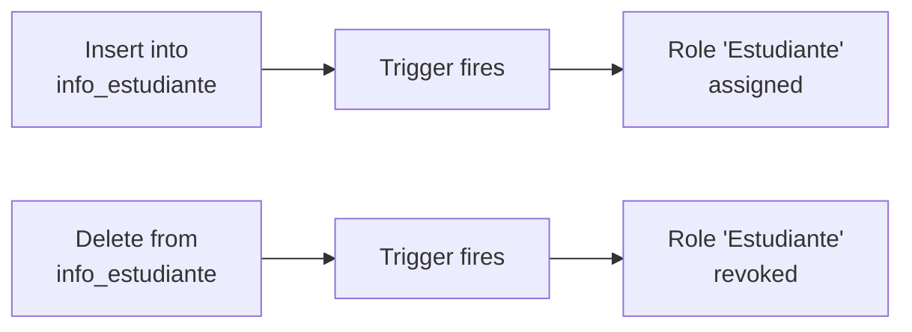

## Overview

The UCC Control de Acceso system uses **PostgreSQL** (via Supabase) to manage contingency access for users without their physical ID card. The database is designed for:

- **Multi-role support**: Users can be Students, Employees, and Contractors simultaneously
- **Automatic role synchronization**: Triggers manage role assignments based on info tables
- **Failure tracking**: Automatic blocking at 4 failures
- **Semester-based lifecycle**: Full data refresh each semester via CSV imports

## Entity-Relationship Diagram

```dbml
// --- Core Tables ---

Table usuarios {
  id BIGINT [primary key, note: 'Internal system ID']
  id_institucional VARCHAR(20) [unique, note: 'UCC-assigned ID (e.g., 80XXXX)']
  documento_identidad VARCHAR(20) [unique, note: 'National ID']
  nombre_completo VARCHAR(150)
  acceso estado_de_acceso [default: 'activo']
  total_fallas INTEGER [default: 0]
}

Table roles {
  id BIGINT [primary key]
  nombre_rol VARCHAR(50) [note: 'Estudiante, Empleado, Contratista']
  descripcion TEXT
}

// Many-to-many: A user can be both Student and Employee
Table usuario_roles {
  id BIGINT [primary key]
  id_institucional VARCHAR(20)
  rol_id BIGINT
}

// --- Role-Specific Information ---

Table info_estudiante {
  id BIGINT [primary key]
  id_institucional VARCHAR(20) [unique]
  programa VARCHAR(150)
}

Table info_empleado {
  id BIGINT [primary key]
  id_institucional VARCHAR(20) [unique]
  cargo VARCHAR(150)
  dependencia VARCHAR(150)
}

Table info_contratista {
  id BIGINT [primary key]
  id_institucional VARCHAR(20) [unique]
  empresa VARCHAR(200)
}

// --- Incident Management ---

Table fallas {
  id BIGINT [primary key]
  id_institucional VARCHAR(20)
  fecha_hora TIMESTAMPTZ [default: 'now()']
  motivo VARCHAR(10) [note: 'olvido | perdida']
}

Table semestres {
  id BIGINT [primary key]
  nombre TEXT [note: '2026-1, 2026-2']
  fecha_inicio DATE
  fecha_fin DATE
  activo BOOLEAN [default: true]
  creado_en TIMESTAMPTZ
}

// --- Relationships ---
Ref: usuario_roles.id_institucional > usuarios.id_institucional [delete: cascade]
Ref: usuario_roles.rol_id > roles.id
Ref: info_estudiante.id_institucional - usuarios.id_institucional [delete: cascade]
Ref: info_empleado.id_institucional - usuarios.id_institucional [delete: cascade]
Ref: info_contratista.id_institucional - usuarios.id_institucional [delete: cascade]
Ref: fallas.id_institucional > usuarios.id_institucional [delete: cascade]
```

## Design Principles

### 1. Stable External Keys

All relationships to users use **`id_institucional`** (VARCHAR) instead of the internal `id` (BIGINT):

<Check>
**Why?** The `id_institucional` is **stable across semesters**, while the internal `id` changes when the database is reset. This allows independent CSV imports without complex ID mapping.
</Check>

```sql
-- CSV imports work directly without needing to look up internal IDs
-- usuarios.csv:
id_institucional, nombre_completo, documento_identidad
80100001,        "Juan Pérez",    "1234567890"

-- info_estudiante.csv:
id_institucional, programa
80100001,        "Ingeniería de Sistemas"
```

### 2. Minimal Data Exposure

The info tables store **only what security guards need to see**:

| Table | Data Stored | Data NOT Stored |
|-------|-------------|-----------------|
| `info_estudiante` | Program name | Semester, grades, GPA, schedule |
| `info_empleado` | Position, department | Salary, contract dates, SSN |
| `info_contratista` | Company name | Contract value, NIT, dates |

<Note>
This follows the principle of **least privilege** and reduces the risk of exposing sensitive personal information.
</Note>

### 3. Automatic Role Management

Roles are **never assigned manually**. Instead, they are synchronized automatically via triggers:



This ensures that:
- Roles always reflect the current state of info tables
- Different departments can load CSVs independently
- Multi-role users are handled automatically

### 4. Automatic Blocking at 4 Failures

The `fallas` table has a trigger that:

1. Recounts failures after each INSERT/DELETE
2. Updates `usuarios.total_fallas`
3. Sets `usuarios.acceso = 'bloqueado'` when count reaches 4

```sql
-- Trigger logic (simplified)
UPDATE usuarios
SET total_fallas = (SELECT COUNT(*) FROM fallas WHERE id_institucional = v_id),
    acceso = CASE WHEN total_fallas >= 4 THEN 'bloqueado' ELSE acceso END
WHERE id_institucional = v_id;
```

## Data Types and Enums

### Custom Types

<CodeGroup>

```sql estado_de_acceso
CREATE TYPE estado_de_acceso AS ENUM ('activo', 'bloqueado');

-- activo    = User can enter
-- bloqueado = Access denied, must visit administration
```

```sql motivo (failure reasons)
CHECK (motivo IN ('olvido', 'perdida'))

-- olvido  = Forgot the ID card (increments counter)
-- perdida = Lost the ID card (immediate block)
```

</CodeGroup>

### Primary Keys

All tables use **`BIGINT GENERATED ALWAYS AS IDENTITY`** for auto-incrementing primary keys:

```sql
CREATE TABLE usuarios (
    id BIGINT GENERATED ALWAYS AS IDENTITY PRIMARY KEY,
    ...
);
```

<Tip>
This is PostgreSQL's recommended approach (preferred over `SERIAL`).
</Tip>

## Table Relationships

### One-to-One (1:1)

Each user can have **at most one** record in each info table:

```
usuarios.id_institucional ←→ info_estudiante.id_institucional
usuarios.id_institucional ←→ info_empleado.id_institucional
usuarios.id_institucional ←→ info_contratista.id_institucional
```

The `UNIQUE` constraint on `id_institucional` in info tables enforces this.

### Many-to-Many (M:N)

Users can have **multiple roles** through the `usuario_roles` junction table:

```
usuarios.id_institucional ←→ usuario_roles.id_institucional
roles.id ←→ usuario_roles.rol_id
```

Example:
```sql
-- User 80100003 is both a Student and an Employee
-- usuario_roles table:
id_institucional | rol_id
-----------------|-------
80100003         | 1      (Estudiante)
80100003         | 2      (Empleado)
```

### One-to-Many (1:N)

Each user can have **multiple failures** over time:

```
usuarios.id_institucional ←→ fallas.id_institucional (many)
```

## Indexes

Performance-critical columns have **B-tree indexes**:

```sql
-- usuarios
CREATE INDEX idx_usuarios_id_institucional ON usuarios (id_institucional);
CREATE INDEX idx_usuarios_documento ON usuarios (documento_identidad);
CREATE INDEX idx_usuarios_acceso ON usuarios (acceso);

-- fallas
CREATE INDEX idx_fallas_id_inst ON fallas (id_institucional);
CREATE INDEX idx_fallas_fecha_hora ON fallas (fecha_hora DESC);

-- info tables
CREATE INDEX idx_info_est_id_inst ON info_estudiante (id_institucional);
CREATE INDEX idx_info_emp_id_inst ON info_empleado (id_institucional);
CREATE INDEX idx_info_con_id_inst ON info_contratista (id_institucional);

-- usuario_roles
CREATE INDEX idx_usuario_roles_institucional ON usuario_roles (id_institucional);
CREATE INDEX idx_usuario_roles_rol ON usuario_roles (rol_id);
```

<Info>
The `DESC` index on `fallas.fecha_hora` optimizes queries like "most recent failures" for the admin dashboard.
</Info>

## Row-Level Security (RLS)

All tables have **RLS enabled** with permissive policies:

```sql
ALTER TABLE usuarios ENABLE ROW LEVEL SECURITY;

CREATE POLICY "usuarios: lectura publica"
  ON usuarios FOR SELECT
  USING (true);

CREATE POLICY "usuarios: insertar"
  ON usuarios FOR INSERT
  WITH CHECK (true);
```

<Warning>
The current policies allow public access for simplicity during development. **In production**, restrict policies to authenticated users with appropriate roles.
</Warning>

## Next Steps

<CardGroup cols={2}>
  <Card title="Table Reference" icon="table" href="/database/tables">
    Detailed column documentation for all tables
  </Card>
  <Card title="Installation Guide" icon="rocket" href="/database/installation">
    Step-by-step setup for Supabase
  </Card>
  <Card title="Migrations" icon="rotate" href="/database/migrations">
    Semester data refresh procedures
  </Card>
  <Card title="Backend Setup" icon="code" href="/development/backend">
    Query examples and API setup
  </Card>
</CardGroup>
