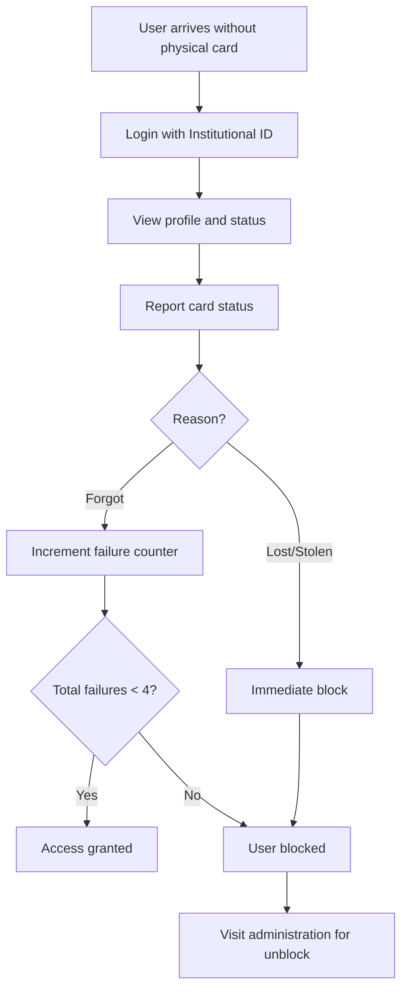

## What is UCC Control de Acceso?

UCC Control de Acceso is a Progressive Web Application (PWA) designed to manage **contingency access** for users who do **not have their physical identification card** at the entry points of Universidad Cooperativa de Colombia.

<Warning>
**Important**: This application is **ONLY** used when users do not have their physical card. It does not register normal daily entries.
</Warning>

## System Purpose

The system provides a streamlined digital process for:

- **Security personnel** to validate and authorize entry for users without physical cards
- **Students, employees, and contractors** to report the status of their TIC (Tarjeta de Identificación Cooperativista)
- **Administrators** to monitor access patterns, manage user blocks, and generate reports

## Key Features

<CardGroup cols={2}>
  <Card title="Simple Login" icon="key">
    Access with just your institutional ID - no complex authentication required
  </Card>
  
  <Card title="Multi-Role Support" icon="users">
    Handles users with multiple roles (Student, Employee, Contractor) seamlessly
  </Card>
  
  <Card title="Automatic Blocking" icon="shield-halved">
    Automatically blocks users after 4 card failures or immediate block for loss/theft
  </Card>
  
  <Card title="Admin Dashboard" icon="chart-line">
    Real-time metrics, user management, and Excel report generation
  </Card>
</CardGroup>

## Who Uses This System?

### End Users

<CardGroup cols={3}>
  <Card title="Students" icon="graduation-cap">
    Access campus when you forget, lose, or have your TIC stolen
  </Card>
  
  <Card title="Employees" icon="briefcase">
    Report card issues and maintain access to facilities
  </Card>
  
  <Card title="Contractors" icon="handshake">
    Temporary staff with contracted access rights
  </Card>
</CardGroup>

### Administrators

Authorized employees with administrative permissions can:

- View real-time access metrics and user status
- Search and manage user accounts
- Unblock users and reset failure counters
- Generate monthly reports in Excel format
- Perform semester data management (CSV upload, database cleanup)

## How It Works

The system follows a failure-based access control model:

### The Failure System

<Steps>
  <Step title="First Failure">
    User reports card issue for the first time. **Access granted** with warning (1/4 failures).
  </Step>
  
  <Step title="Second & Third Failures">
    Continued reports increment the counter. **Access still granted** but risk increases (2/4, 3/4).
  </Step>
  
  <Step title="Fourth Failure">
    After the 4th report of forgetting the card, user is **automatically blocked**.
  </Step>
  
  <Step title="Loss or Theft">
    Any report of card loss or theft results in **immediate blocking**, regardless of previous failures.
  </Step>
</Steps>

## User States

| State | Description | Can Access? | Required Action |
|-------|-------------|-------------|-----------------|
| `activo` (Active) | User without restrictions | ✅ Yes | None |
| `bloqueado` (Blocked) | User has active restrictions | ❌ No | Visit administration office |

<Note>
All blocks (whether from accumulated failures or lost/stolen cards) can be removed by administrators. When unblocked, the failure counter resets to 0.
</Note>

## Core Technologies

The system is built with modern web technologies:

**Frontend**
- React with React Router for navigation
- Tailwind CSS for styling with UCC brand colors
- Supabase for backend integration

**Backend**
- MySQL/MariaDB database
- RESTful API architecture
- Stored procedures for business logic

**Design System**
- UCC institutional colors (Blue `#003DA5` and Orange `#FF6B35`)
- Mobile-first responsive design
- Accessible and intuitive interface

## Database Architecture

The system uses a comprehensive relational database with the following core tables:

- **Usuarios** - Main user information and status
- **Roles** - Role definitions (Student, Employee, Contractor)
- **Usuario_Roles** - Many-to-many relationship (users can have multiple roles)
- **Info_Estudiantes / Info_Empleados / Info_Contratistas** - Role-specific information
- **Registro_Fallas** - History of all card failures
- **Historial_Bloqueos** - Block and unblock records
- **Administradores** - Administrative permissions
- **Auditoria** - Complete audit trail

## Security & Privacy

<CardGroup cols={2}>
  <Card title="Data Protection" icon="lock">
    Sensitive data encrypted at rest and in transit via HTTPS
  </Card>
  
  <Card title="Audit Trail" icon="file-lines">
    Complete logging of all administrative actions
  </Card>
  
  <Card title="Role-Based Access" icon="user-shield">
    Granular permissions based on user roles
  </Card>
  
  <Card title="Input Validation" icon="check-double">
    SQL injection prevention and input sanitization
  </Card>
</CardGroup>

## Semester Management

At the end of each academic semester, administrators perform the following workflow:

<Steps>
  <Step title="Export Data">
    Generate complete Excel reports of all semester data
  </Step>
  
  <Step title="Clean Database">
    Remove all user records except administrators
  </Step>
  
  <Step title="Import New Semester">
    Upload CSV file with new semester user data
  </Step>
  
  <Step title="Reset Counters">
    All failure counters start at 0 for the new semester
  </Step>
</Steps>

## Next Steps

<CardGroup cols={2}>
  <Card title="Quick Start" icon="rocket" href="/quickstart">
    Learn how to use the system as an end user
  </Card>
  
  <Card title="Admin Guide" icon="user-tie" href="/admin/dashboard">
    Discover administrative features and workflows
  </Card>
</CardGroup>

---

<Note>
© 2026 Universidad Cooperativa de Colombia. All rights reserved.
</Note>
